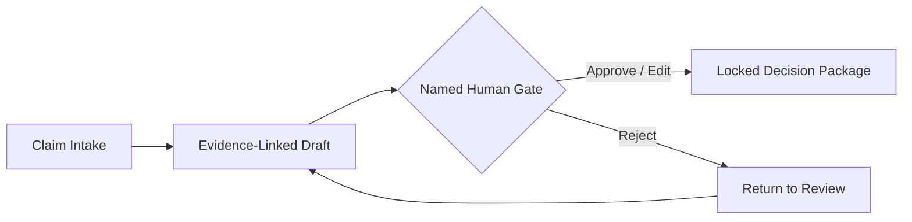

<div align="center">

# Oliver Paynter

### Founder • Operator • Roofer-first builder of governed AI

[](#the-thesis)
[](#what-im-building)
[](#operating-rule)

**Founder / CEO, [OrPaynter, Inc.](https://github.com/Orpaynter-Inc)**  
Building systems where evidence is linked, decisions are named, and automation does not outrun human authority.

[orpaynter.ai](https://orpaynter.ai) · [ov@orpaynter.com](mailto:ov@orpaynter.com)

<br>

[](https://app.notion.com/p/OrPaynter-Trust-Rail-for-the-Agentic-Era-c542fbe957d9424b83279d767ccf2aa7)

<sub>Strategy, systems, decisions, and operating intelligence behind OrPaynter, Inc.</sub>

</div>

---

## ⚡ The thesis

Most people are using AI to generate more output.

I am building AI that can survive contact with reality.

OrPaynter builds **governed AI for roofing insurance claims**.

```text
Intake
  ↓
Evidence-linked draft
  ↓
Named human gate
  ↓
Locked Decision Package
```

> **AI drafts. Humans govern. Proof matters.**

This is not AI that replaces judgment. It is a system where the machine prepares the work, while a real human remains responsible for the final decision.

---

## 🧠 OrPaynter Intelligence

The code is the build trail.

The Notion workspace is the thinking layer behind the build: product doctrine, research, architecture, decisions, projects, and the **Trust Rail for the Agentic Era**.

> **GitHub shows what is being built.**  
> **Notion shows why it exists.**  
> **Reality decides what survives.**

[](https://app.notion.com/p/OrPaynter-Trust-Rail-for-the-Agentic-Era-c542fbe957d9424b83279d767ccf2aa7)

```text
┌─────────────────────────────────────────────────────┐
│  ORPAYNTER, INC. — THE TRUST RAIL                   │
├─────────────────────────────────────────────────────┤
│  Vision        → What must become true              │
│  Strategy      → What gets built next               │
│  Product       → ClaimFlow + governed workflows     │
│  Evidence      → What can be proven                 │
│  Decisions     → What a human has authorized        │
│  Execution     → What survives the real world       │
└─────────────────────────────────────────────────────┘
```

---

## 🧬 Prompt Intelligence Corpus

OrPaynter is not built on a folder of clever prompts.

It is being shaped by a proprietary corpus of **200,000+ prompt patterns, agent instructions, workflow structures, evaluation ideas, failure cases, claim scenarios, and decision frameworks**.

```text
Raw prompts
   ↓
Structured patterns
   ↓
Agent roles and constraints
   ↓
Evidence-aware workflows
   ↓
Human-governed decisions
   ↓
Reusable operating intelligence
```

> A prompt is a suggestion.  
> A governed workflow is an operating system.

The purpose is not to make AI sound impressive. The purpose is to make AI useful, bounded, inspectable, and accountable.

---

## 🧭 Why this repo exists

This repository is the **canonical vs historical** map of `github.com/orpaynter`.

A GitHub account can become a graveyard of good ideas: prototypes, experiments, tool forks, older architecture, marketing shells, and real product foundations all sitting next to each other.

This page exists to make the signal obvious:

```text
Signal > noise
Proof > polish
Authority > automation theater
Reality > repo confusion
```

---

## 🏗️ What I’m building

ClaimFlow is designed for the real world of roofing insurance claims—where a decision is never just text on a screen.



The objective:

- Make preparation faster
- Keep evidence attached to the work
- Keep authority attached to a named human
- Preserve what was decided, why it was decided, and what supports it

---

## 🧱 Canonical direction

| Repository | Role | Signal |
|---|---|---|
| [AIA](https://github.com/orpaynter/AIA) | Backend authority | Decision Package logic and human gate control |
| [claimflow](https://github.com/orpaynter/claimflow) | Shared case state machine | Portable proof and case-flow logic |
| [orpa](https://github.com/orpaynter/orpa) | Governed operator layer | A named human owns the final decision |
| [orpaynter-web](https://github.com/orpaynter/orpaynter-web) | Public verification surface | Controlled external verification path |

---

## 🔥 What makes this different

A lot of AI products try to impress with output.

The better questions are:

- Who owns the decision?
- What evidence supports it?
- Can the result be challenged later?
- Can the workflow be inspected after the fact?

```text
Automation is not authority.
A polished artifact is not automatically current.
An HTTP 200 is not customer production.
Real jobs + tests beat claims.
```

---

## 👷 About me

I build from the field upward.

Roofing taught me that real work is messy, evidence matters, and bad decisions cost people money. That experience shapes everything here.

- AI should compress effort—not erase responsibility
- Evidence should travel with the output
- Decisions should have accountable owners
- Verification should outrank presentation
- Software should hold up outside the demo

<div align="center">

## AI drafts. Humans govern.

### Proof matters.

</div>
