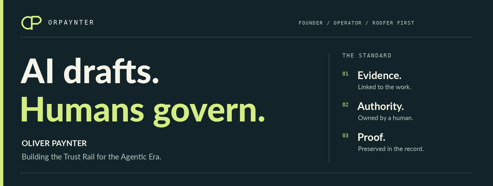
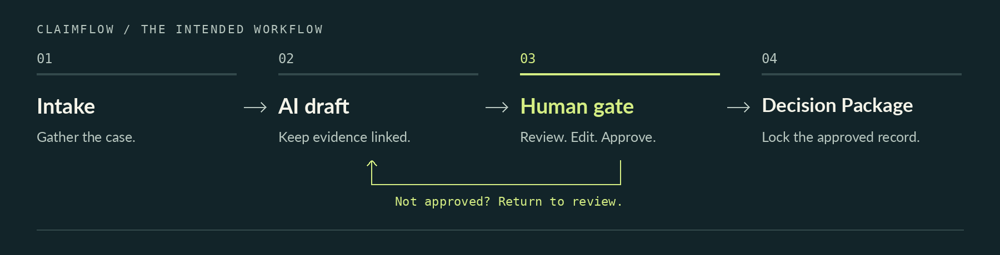

  <picture>
    <source media="(max-width: 600px)" srcset="./assets/orpaynter-banner-mobile.png">
    
  </picture>

# Oliver Paynter

Founder / CEO of [OrPaynter, Inc.](https://github.com/Orpaynter-Inc). AI systems architect. Roofer first. I build governed AI for roofing insurance claims, starting with the work I know firsthand.

**The machine prepares the work. A named human owns the decision.**

[Explore the company](https://orpaynter.ai) · [OrPaynter Intelligence](https://app.notion.com/p/OrPaynter-Trust-Rail-for-the-Agentic-Era-c542fbe957d9424b83279d767ccf2aa7) · [Get in touch](mailto:ov@orpaynter.com)

[ClaimFlow](#claimflow) · [The build map](#the-build-map) · [The thinking behind the build](#the-thinking-behind-the-build)

---

## Built from the field up

Roofing taught me that evidence matters, real work is messy, and bad decisions cost people money. That is the starting point for OrPaynter, not an afterthought.

I am building for the moment when an AI-generated draft becomes someone's responsibility. The evidence should still be attached. The decision should have an owner. And the record should explain what happened.

## ClaimFlow

### Faster preparation. Human authority. A record that holds up.

ClaimFlow is being built to move roofing insurance claims from scattered information to an evidence-linked draft, through a named human review, and into a locked Decision Package.

  <picture>
    <source media="(max-width: 600px)" srcset="./assets/claimflow-workflow-mobile.png">
    
  </picture>

| Principle | What we are designing for |
| :--- | :--- |
| **Evidence stays attached** | The supporting material travels with the draft, not in a separate trail of messages. |
| **Authority stays human** | A named person reviews the work. AI output is not approval. |
| **Decisions stay inspectable** | Preserve what was decided, who authorized it, and what supports it. |

> **The operating rule:** Automation is not authority. A polished demo is not proof of customer production.

## The build map

GitHub is the build trail, not every experiment promoted to a product. The map below separates the canonical architecture from supporting work, historical builds, and upstream tools.

<strong>Explore the architecture and repository map</strong>

### Canonical direction

These are the four repositories identified as the canonical direction in this account, not a claim that every component is production-ready.

| Repository | Responsibility |
| :--- | :--- |
| [**AIA**](https://github.com/orpaynter/AIA) | Backend authority, Decision Package logic, and human-gate controls. |
| [**claimflow**](https://github.com/orpaynter/claimflow) | Shared case state machine and portable proof. |
| [**orpa**](https://github.com/orpaynter/orpa) | Governed operator layer. A named human owns the final decision. |
| [**orpaynter-web**](https://github.com/orpaynter/orpaynter-web) | External verification surface, distinct from older marketing sites. |

Core working repositories may require access. This public page is the map, not an open-source release of the full system.

### Supporting work

- **orpaynter-claim-rail:** Foreman UI work, separate from the four-repository canonical direction.
- **orpaynter-agent-factory:** Internal agent constitution work. Agent instructions do not confer decision authority.
- **website:** Marketing and SaaS shell, not evidence of working product capabilities.

### Historical builds

Older overlays, THE-ONE copies, Nexus spaces, starter projects, investor databases, mobile experiments, and tutorial repositories remain part of the build history. They should not be treated as the current platform.

### Upstream tools

Forks such as UI-TARS-desktop, browser-use, and Auto-GPT are upstream tools, not original OrPaynter products.

### Verification boundary

Treat synthetic bundles and machine checks as synthetic or machine proof, not customer validation. A real job, tests, and a named human's verification matter more than a live URL or the newest presentation.

## The thinking behind the build

**OrPaynter Intelligence** is the strategy and systems layer behind the code: product doctrine, research, architecture, decisions, and the Trust Rail for the Agentic Era.

The work includes prompt patterns, agent instructions, workflow structures, evaluation ideas, and failure cases. The aim is not a bigger pile of prompts. It is reusable operating intelligence with boundaries, evidence, and accountable owners.

[Explore OrPaynter Intelligence in Notion](https://app.notion.com/p/OrPaynter-Trust-Rail-for-the-Agentic-Era-c542fbe957d9424b83279d767ccf2aa7)

---

## Build something that holds up.

If you work in roofing, claims, or AI systems where someone must stand behind the outcome, let's talk. I am building from the field upward, with proof ahead of promises.

[**Start a conversation**](mailto:ov@orpaynter.com) · [orpaynter.ai](https://orpaynter.ai) · [Company GitHub](https://github.com/Orpaynter-Inc)

AI drafts. Humans govern. Proof matters.

