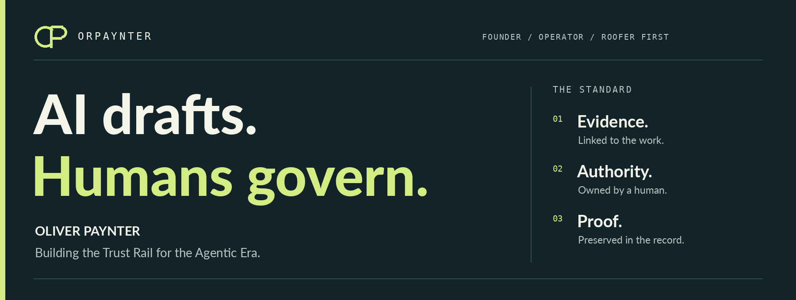
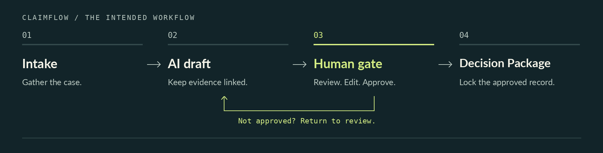

  <picture>
    <source media="(max-width: 600px)" srcset="./assets/orpaynter-banner-mobile.png">
    
  </picture>

# Oliver Paynter

**Founder / CEO, [OrPaynter, Inc.](https://github.com/Orpaynter-Inc)**  
Roofer first. Building governed AI systems from real field work.

## From one roof to governed AI systems

OrPaynter starts with a real roofing workflow: a claim arrives messy, evidence gets organized, gaps stay visible, and a named human controls the gate.

**AI drafts. You govern.**

[Open OrPaynter](https://orpaynter.ai) · [Explore ClaimFlow](https://orpaynter.ai/claimflow) · [Company GitHub](https://github.com/Orpaynter-Inc) · [Email Oliver](mailto:Ov@OrPaynter.com)

---

## Start with the roof

Photos, estimates, weather, notes, and job files rarely arrive as one clean package. ClaimFlow turns that scattered information into structured, review-ready work without silently expanding the machine's authority.

  <picture>
    <source media="(max-width: 600px)" srcset="./assets/claimflow-workflow-mobile.png">
    
  </picture>

| Step | Control |
|---|---|
| **Gather evidence** | Bring photos, files, notes, and claim context into one case. |
| **Reason** | AI organizes the mess and prepares an evidence-linked draft. |
| **Gate actions** | A named human reviews, approves, rejects, or returns the work. |
| **Record proof** | The decision, reviewer, evidence, and context stay together. |
| **Learn safely** | The system can improve without granting itself more authority. |

**ClaimFlow:** intake → evidence-linked draft → human gate → locked Decision Package.

---

## One system. Four controlled surfaces.

> **Web sells. ClaimFlow proves. ORPA controls. DecisionPackage verifies.**

| Surface | Role |
|---|---|
| **Web** | Explains the product, the workflow, and the proof boundary. |
| **ClaimFlow** | Organizes a messy claim into evidence-linked, review-ready work. |
| **ORPA** | Gives an identity-bound human the approve / reject control surface. |
| **DecisionPackage** | Preserves who decided what, from which evidence, and when. |

The objective is not autonomous authority. It is a controlled, auditable operating loop that helps people move faster while remaining responsible for consequential decisions.

---

## Canonical build map

These repositories define the current direction. Other repositories on this account may be experiments, upstream tools, tutorials, or historical work.

| Repository | Role |
|---|---|
| [**AIA**](https://github.com/orpaynter/AIA) | ClaimFlow intelligence and authority backend. |
| [**claimflow**](https://github.com/orpaynter/claimflow) | Shared case state machine and governed claim flow. |
| [**orpa**](https://github.com/orpaynter/orpa) | Identity-bound operator control surface. |
| [**orpaynter-web**](https://github.com/orpaynter/orpaynter-web) | Public site, ClaimFlow demo, OS preview, and verification surfaces. |

**How to read this account:** company identity defines who we are; the canonical repositories define what the product does; real jobs and tests define what works. A newer demo does not outrank evidence.

---

## Operating law

1. **The system drafts. A named human approves.**
2. **Agents may become more capable. They may never give themselves more authority.**
3. **Money-facing and customer-facing actions require evidence and a reconstructable Decision Package.**
4. **Synthetic demonstrations are labeled as synthetic.**
5. **No accuracy, ROI, certification, production, or customer claims without proof from real work.**

---

## Proof boundary

| What you see | What it proves |
|---|---|
| **Live page** | The public surface loads. |
| **Interactive demo** | The workflow can be inspected with synthetic data. |
| **Agent output** | Automation prepared work; it did not authorize the outcome. |
| **Decision Package** | The decision, authority, evidence, and context can be reconstructed. |
| **Real job + named reviewer** | The standard that matters. |

The question is not whether the software looks impressive. The question is whether a person can inspect the evidence, own the decision, and stand behind it later.

---

## Company boundary

**OrPaynter, Inc.** is the software company.

**Oliver's Roofing & Contracting** is the trade company and real-world domain foundation. Roofing experience informs the product; the companies are separate entities.

The company face is [Orpaynter-Inc](https://github.com/Orpaynter-Inc). This `orpaynter` account remains the founder and build trail while canonical repositories are prepared for transfer.

---

## Build with us

If you work in roofing, claims, field operations, insurance, or governed AI—and you believe faster systems should still leave a human clearly accountable—I want to hear from you.

**Stop drowning in claims. Start closing them.**

  <a href="https://orpaynter.ai"><b>See the system</b></a> ·
  <a href="https://orpaynter.ai/claimflow"><b>Run ClaimFlow</b></a> ·
  <a href="mailto:Ov@OrPaynter.com"><b>Talk to Oliver</b></a>

OrPaynter, Inc. · Built on Trust. Powered by AI. · AI drafts. You govern.

